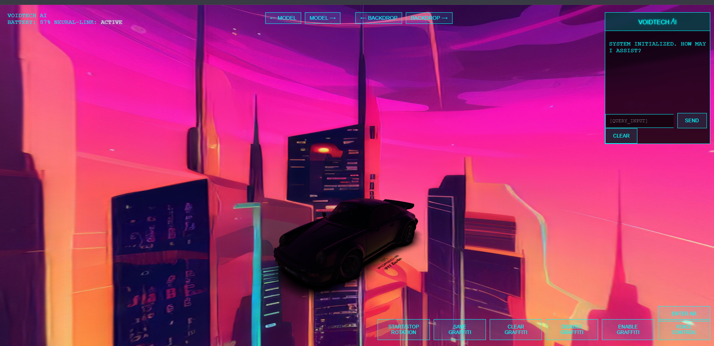

# VOIDTECH 🌌



VoidTech is a stylized, interactive 3D viewer powered by Three.js.  
It features custom shaders, glitch FX, and a cyberpunk AI assistant UI built from scratch.

---

## 🚀 Features

- 🎮 Drag-to-rotate & scroll-to-zoom 3D model interaction  
- 🌫️ Dynamic environment maps with fog & lighting  
- 🧠 Integrated chatbot UI (no API key needed)  
- 🎭 Change models and backdrops dynamically with navigation buttons  
- 💥 Randomized glitch/shake FX for immersive aesthetics  
- 🖥️ Pure HTML/CSS/JS — no frameworks

---

## 📦 Requirements

- A modern browser with WebGL support  
- Local or CDN-hosted `.glb` models (see below)  
- Recommended: use [Live Server](https://marketplace.visualstudio.com/items?itemName=ritwickdey.LiveServer) for local testing

---

## 🗂️ Assets

> ⚠️ This repository does **not** include `.glb` model files due to GitHub's large file limitations.

To run this project properly:

1. 🔻 Download or create your own `.glb` model files.
2. 🗂️ Place them inside:  assets/models/
3. ✅ Ensure your filenames match what's expected in the code (`product.glb`, `hut.glb`, etc.)  
Or modify `viewer.js` to use your own filenames.

---

## 📸 Screenshot

You should see something like this on launch:


---

## 🧠 AI Chatbot

No external API required — the AI assistant responds with hardcoded, stylized prompts.  
You can extend its logic in `chatbot.js` using your own conditions or a local model.

---

## 🧪 Development

To clone and run locally:

```bash
git clone https://github.com/Keninjavelas/VoidTech.git
cd VoidTech

Open index.html using a local server (recommended) or by double-clicking it.
