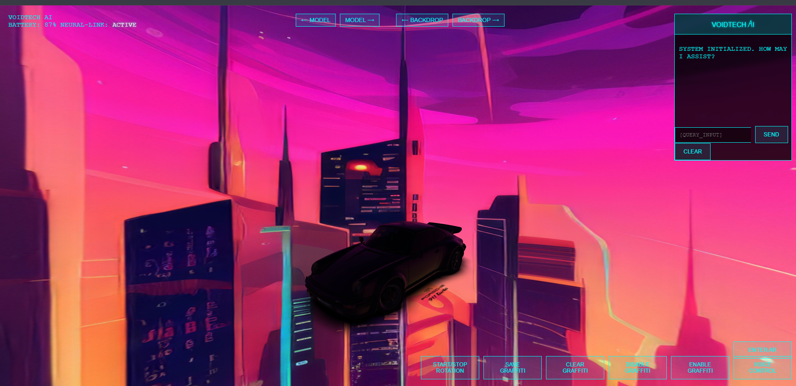

# VOIDTECH 🌌

### Immersive 3D Experiences for the Cyberpunk Web

<p align="center">
  
  
  
  
  
</p>

<p align="center">
  
</p>

<br />


<br />



<br />


<br />

**VoidTech** is a high-fidelity **interactive 3D web experience** powered by **Three.js**.
It merges real-time rendering, custom shaders, glitch-driven effects, and a futuristic AI assistant UI into a single cyberpunk-inspired system.

No frameworks.
No abstraction layers.
Just raw, expressive WebGL.

---

<br />


<br />

## ✨ Core Features

* 🎮 **Fluid 3D Interaction**
  Drag-to-rotate, scroll-to-zoom, smooth camera damping

* 🌫️ **Atmospheric Rendering**
  Dynamic environment maps, volumetric fog, cinematic lighting

* 🧠 **Integrated AI Assistant UI**
  Fully local, stylized chatbot — no API keys, no external services

* 🎭 **Dynamic Scene Control**
  Swap models and backdrops in real time via navigation controls

* 💥 **Cyberpunk FX Engine**
  Randomized glitch, shake, and distortion effects for immersion

* 🖥️ **Framework-Free Architecture**
  Built with pure HTML, CSS, and JavaScript

---

<br />


<br />

## 🧠 Design Philosophy

VoidTech is built around a simple idea:

> **The web can feel alive.**

### Principles

* **Immersion over UI clutter**
* **Aesthetic-driven engineering**
* **Zero vendor lock-in**

### Ideal Use Cases

* Interactive product showcases
* Sci-fi & cyberpunk portfolios
* Experimental UI / UX research
* Creative WebGL playgrounds

---

<br />


<br />

## 📦 Requirements

To run VoidTech, you’ll need:

* A modern browser with **WebGL** support
* One or more `.glb` 3D model files
* A local web server (recommended)

### 🔧 Recommended Local Server

[Live Server (VS Code Extension)](https://marketplace.visualstudio.com/items?itemName=ritwickdey.LiveServer)

---

<br />


<br />

## 🗂️ Assets & Models

> ⚠️ This repository **does not include `.glb` model files** due to GitHub size limitations.

### How to add models

1. 🔻 Obtain or create `.glb` files
2. 📁 Place them in:

   ```
   assets/models/
   ```
3. ✅ Match filenames used in the code
   (e.g. `product.glb`, `hut.glb`)

To customize filenames or loading logic, edit:

```
viewer.js
```

---

<br />


<br />

## 🧠 AI Assistant

VoidTech includes a **local AI-style chatbot interface** designed for futuristic demos and UX experiments.

* 🚫 No external APIs
* 🔐 No API keys
* 🎨 Fully stylized and extensible

The current logic uses hardcoded cinematic responses.

Extend or replace behavior in:

```
chatbot.js
```

Possible extensions:

* Rule-based logic
* Local LLM inference
* Cloud API integration

---

<br />


<br />

## 🧪 Development & Usage

Clone the repository:

```bash
git clone https://github.com/Keninjavelas/VoidTech.git
cd VoidTech
```

Run using a local server (recommended),
or open `index.html` directly for quick testing.

---

<br />


<br />

## 🧠 Tech Stack

* Three.js
* WebGL
* GLSL Shaders
* Vanilla JavaScript
* HTML5 / CSS3

---

<br />


<br />

## 🧩 Customization Ideas

* Add bloom, CRT, or chromatic aberration post-processing
* Swap shaders for hologram or wireframe effects
* Connect the chatbot to a real LLM
* Turn VoidTech into a landing page or portfolio

---

<br />


<br />

## 📜 License

MIT License

Copyright (c) 2026 VoidTech


<p align="center">
  Built for the future. Rendered in real time.
</p>

---

